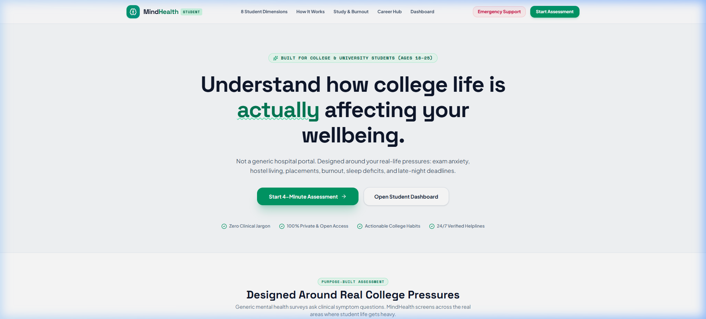
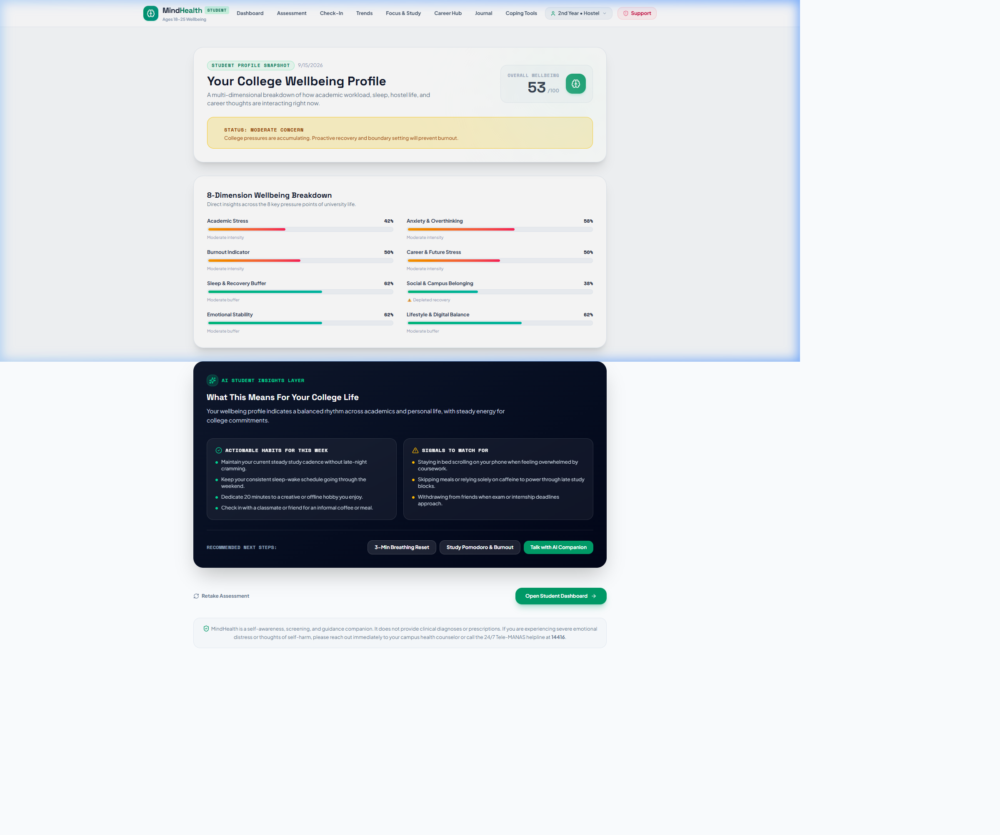
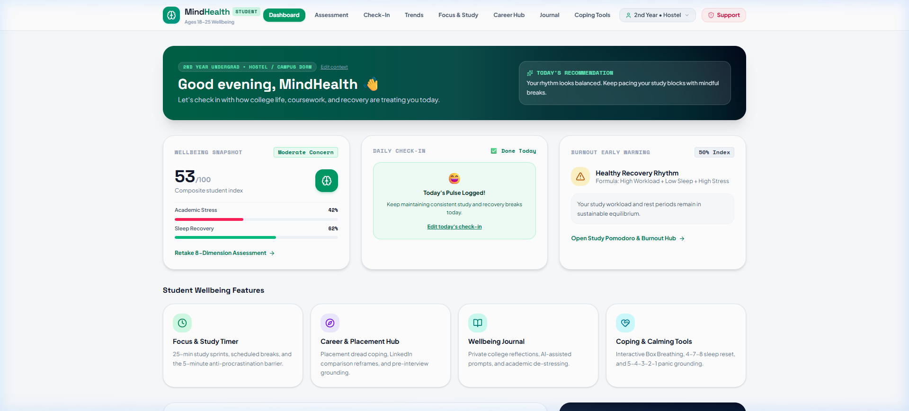
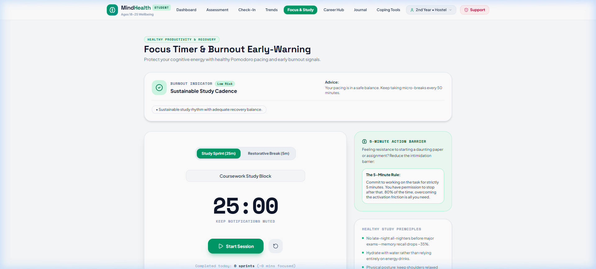
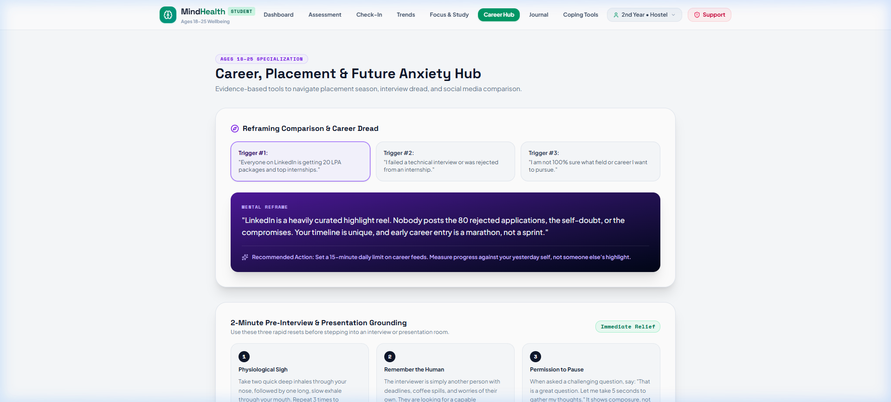
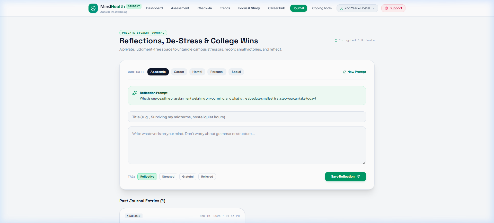
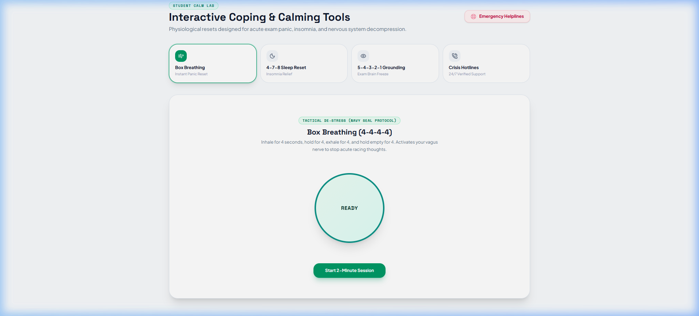
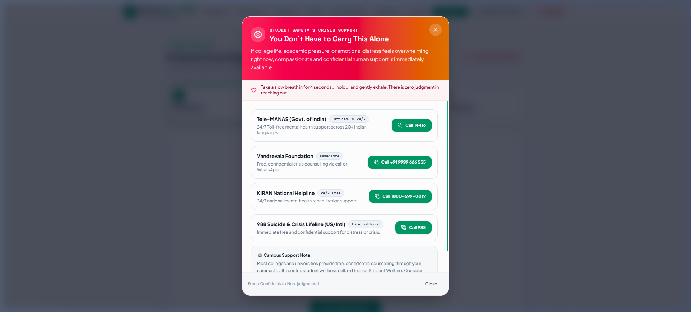

<div align="center">

# 🧠 MindHealth
### *Student Wellbeing & Mental Health Platform for College Students (18–25)*

[](https://react.dev/)
[](https://vitejs.dev/)
[](https://fastapi.tiangolo.com/)
[](https://www.python.org/)
[](https://tailwindcss.com/)
[](https://www.tensorflow.org/)
[](https://scikit-learn.org/)
[](https://ai.google.dev/)
[](LICENSE)

<br/>

🌐 **Live Demo:** [mindhealth-three.vercel.app](https://mindhealth-three.vercel.app/)

<br/>

> **MindHealth** is a purpose-built multimodal AI wellbeing screening and support platform designed specifically for college and university students aged **18–25**. It combines an 8-dimension psychometric assessment engine, AI-generated insights via **Google Gemini Flash**, daily habit tracking, burnout monitoring, and interactive coping tools — all grounded in the real-life pressures of academic life: exam stress, placement anxiety, hostel living, sleep debt, and career uncertainty.
>
> ⚠️ *MindHealth is a self-awareness and guided support tool, not a clinical diagnostic instrument. It is not a replacement for professional mental health care.*

<br/>

---

</div>

## 📑 Table of Contents

- [🌟 Executive Summary](#-executive-summary)
- [🏗️ System Architecture](#️-system-architecture)
- [✨ Student-Focused Feature Set](#-student-focused-feature-set)
- [🤖 Multimodal AI Pipeline](#-multimodal-ai-pipeline)
- [🧠 AI Insights Engine (Gemini Flash)](#-ai-insights-engine-gemini-flash)
- [🛠️ Complete Technology Stack](#️-complete-technology-stack)
- [🗃️ Database Schema](#️-database-schema)
- [🔌 API Reference](#-api-reference)
- [📁 Project Structure](#-project-structure)
- [⚙️ Setup & Local Development](#️-setup--local-development)
- [🚀 Production Deployment](#-production-deployment)
- [🖥️ Platform Screenshots](#️-platform-screenshots)
- [🛡️ Security & Safety Design](#️-security--safety-design)
- [⚖️ Advantages & Limitations](#️-advantages--limitations)
- [🔮 Future Scope](#-future-scope)

---

## 🌟 Executive Summary

### The Problem

College students aged 18–25 represent the most underserved segment of the mental health landscape. They face a unique convergence of stressors that general-purpose wellness apps fail to address:

| Stressor | Reality |
|----------|---------|
| **Academic Pressure** | Semester deadlines, surprise tests, grade anxiety |
| **Career & Placement Dread** | Job rejections, LinkedIn comparison, internship burnout |
| **Living Transitions** | Hostel isolation, shared PGs, first time away from home |
| **Sleep Deprivation** | Late-night study, irregular meals, caffeine dependency |
| **Social Overload** | Group projects, social comparison, digital FOMO |
| **Financial Stress** | Tuition fees, dependency on family, scholarship pressure |

Traditional mental health tools suffer from three structural flaws when applied to students:

1. **Clinical Jargon Barrier** — PHQ-9 and GAD-7 language alienates students who do not see themselves as "patients"
2. **Unimodal Assessment** — A single self-report questionnaire misses the full psychological picture
3. **Generic Recommendations** — Breathing exercises with no academic context

### The MindHealth Solution

MindHealth is re-architected from the ground up to serve this cohort through:

- 🎯 **Purpose-built 8-dimension screening** using student-relatable language (no clinical jargon)
- 🤖 **Gemini Flash AI insights** generating weekly habit plans grounded in academic context
- 📊 **Daily check-in telemetry** tracking mood, sleep, energy, and academic pressure over time
- 🔥 **Burnout early-warning system** correlating study sessions with sleep debt
- 🧘 **Interactive coping toolkit** (Box Breathing, 4-7-8 sleep reset, 5-4-3-2-1 grounding)
- 🆘 **Always-accessible crisis layer** with verified Indian 24/7 free helplines

---

## 🏗️ System Architecture

```
+---------------------------------------------------------------------+
|                        USER (Browser)                               |
|          College Student, Age 18-25, Any Device                     |
+------------------------------+--------------------------------------+
                               | HTTPS
                               v
+---------------------------------------------------------------------+
|               FRONTEND  .  React 19 + Vite 7                        |
|               Deployed: Vercel (CDN, global edge)                   |
|                                                                     |
|  +------------+ +--------------+ +--------------+ +-------------+  |
|  |  Landing   | |  Onboarding  | |  Assessment  | |  Dashboard  |  |
|  |  Page      | |  Modal       | |  Engine      | |  Command Ctr|  |
|  +------------+ +--------------+ +--------------+ +-------------+  |
|  +------------+ +--------------+ +--------------+ +-------------+  |
|  |  Focus &   | |  Career      | |  Wellbeing   | |  Coping     |  |
|  |  Burnout   | |  Anxiety Hub | |  Journal     | |  Toolkit    |  |
|  +------------+ +--------------+ +--------------+ +-------------+  |
|  +------------+ +--------------+ +--------------+                  |
|  |  Daily     | |  Analytics   | |  Multimodal  |                  |
|  |  Check-In  | |  Trends      | |  AI Lab      |                  |
|  +------------+ +--------------+ +--------------+                  |
+------------------------------+--------------------------------------+
                               | REST API (JSON) . VITE_API_URL
                               v
+---------------------------------------------------------------------+
|               BACKEND  .  FastAPI + Uvicorn                         |
|               Deployed: Render (Docker container, Oregon)           |
|                                                                     |
|  +--------------+  +----------------+  +----------------------+    |
|  |  Auth Router |  | Student Router |  |  Dashboard Router    |    |
|  |  /api/auth/  |  | /api/student-  |  |  /dashboard-data     |    |
|  |  JWT + bcrypt|  |  assessment/   |  |  /api/student/       |    |
|  +--------------+  +----------------+  +----------------------+    |
|  +--------------+  +----------------+  +----------------------+    |
|  |  Chat Router |  |  Face Router   |  |  Voice Router        |    |
|  |  /api/chat/  |  |  /api/face/    |  |  /api/voice/         |    |
|  +--------------+  +----------------+  +----------------------+    |
+-----------------+----------------------------+----------------------+
                  |                            |
        +---------v--------+    +--------------v---------+
        |  AI / ML Layer   |    |    Database Layer      |
        |                  |    |                        |
        |  Google Gemini   |    |  SQLite + SQLAlchemy   |
        |  Flash (Insights)|    |  13 tables             |
        |  ResNet-50       |    |  (User, Assessment,    |
        |  (Face Emotion)  |    |  CheckIn, Journal,     |
        |  CNN + Librosa   |    |  StudySession, Chat,   |
        |  (Voice Stress)  |    |  Face, Voice...)       |
        |  Scikit-Learn    |    |                        |
        |  (Behaviour ML)  |    +------------------------+
        +------------------+
```

### Data Flow — Student Journey

```
Sign Up / Login
     |
     v
Onboarding Modal  (year, major, living situation, stressors)
     |
     v
8-Dimension Wellbeing Assessment  (20 questions, one at a time)
     |
     v
Results Card + Gemini AI Insights  (overview, habits, watch-for signals)
     |
     v
Student Dashboard  (burnout warning, wellbeing pulse, micro-habits)
     |
     +---> Daily Check-In       (mood, sleep, energy, academic pressure)
     +---> Analytics & Trends   (Recharts 7/30/90-day charts)
     +---> Focus & Burnout Hub  (Pomodoro, burnout detector)
     +---> Career Anxiety Hub   (pre-interview grounding)
     +---> Wellbeing Journal    (AI-prompted private reflection)
     +---> Coping Toolkit       (breathing, sleep reset, grounding)
     +---> Multimodal AI Lab    (face emotion, voice stress, chat counselling)
```

---

## ✨ Student-Focused Feature Set

### 🎓 Student Onboarding

When a student logs in for the first time, an onboarding modal collects lightweight academic context to personalize every subsequent experience:

- **Year of Study**: 1st Year, 2nd Year, 3rd Year, Final Year, Postgraduate
- **Field of Study**: Engineering/Tech, Medical, Commerce, Humanities, Science, Law
- **Living Situation**: Hostel/Campus Dorm, Shared PG, Commuter/Living with Family
- **Academic Stage**: Regular Semester, Mid-terms, Final Exams, Placements/Internships, Vacation
- **Top Stressors** (multi-select): Exams, Placements, Sleep, Loneliness, Finances, Social Anxiety, Burnout, Family Expectations

This context is stored in the `StudentProfile` table and surfaces throughout the platform.

---

### 📋 8-Dimension Wellbeing Assessment

A conversational, one-question-at-a-time assessment covering 8 psychologically-grounded dimensions specific to college life. Each dimension is scored 0–100 (normalized):

| # | Dimension | What It Measures | High Score Means |
|---|-----------|-----------------|------------------|
| 1 | **Academic Stress** | Workload, deadline pressure, study-life balance | Severe overload |
| 2 | **Anxiety** | Worry frequency, physical symptoms, catastrophizing | High anxiety |
| 3 | **Burnout** | Emotional exhaustion, motivation loss, cynicism | Active burnout |
| 4 | **Sleep Health** | Sleep hours, quality, schedule consistency | Poor recovery |
| 5 | **Social Connection** | Loneliness, peer support, belonging | Isolated |
| 6 | **Career Stress** | Placement dread, comparison, uncertainty | High career anxiety |
| 7 | **Emotional Wellbeing** | Mood stability, joy, irritability | Emotionally distressed |
| 8 | **Lifestyle Balance** | Nutrition, physical activity, breaks | Unbalanced |

The assessment generates an **overall wellbeing index (0–100)** mapped to severity:

```
Score    Category                  Indicator
-----    --------                  ---------
75-100   Doing Well                Green
55-74    Mild Concern              Yellow
40-54    Moderate Concern          Orange
25-39    High Concern              Red
 0-24    Needs Immediate Support   Dark Red
```

---

### 🔥 Focus & Burnout Hub

**Pomodoro Study Timer** — 25-minute focused sprint → 5-minute break. Sessions logged to `StudySession` table.

**Burnout Detector** — Aggregates study hours vs. average sleep over 7 days. Triggers three-tier alert:
- `Monitoring` → `Early Warning` → `Rest Required`
- Condition: weekly_study_hours > 35 AND avg_sleep < 6h → High Burnout Risk

**5-Minute Action Barrier Rule** — Anti-procrastination reflection for daunting tasks.

---

### 💼 Career & Placement Anxiety Hub

- LinkedIn Comparison Reframe cards
- Rejection Recovery Protocol (3-step structured response)
- 2-Minute Pre-Interview Grounding (Breathe → Ground → Affirm)
- Uncertainty Tolerance Builder

---

### 📔 Wellbeing Journal

Private reflection with AI-powered category-specific prompts:

| Category | Example Prompt |
|----------|----------------|
| Academic | "What subject made you feel most capable this week, and why?" |
| Career | "Write about one fear around placements you haven't said out loud" |
| Hostel Life | "Describe a small moment from hostel life that made you smile" |
| Personal Growth | "What do you know now that you didn't at the start of this semester?" |

---

### 🧘 Coping Toolkit

| Tool | Technique | Best For |
|------|-----------|----------|
| **Box Breathing** | 4s inhale, 4s hold, 4s exhale, 4s hold | Pre-exam panic |
| **4-7-8 Sleep Reset** | 4s inhale, 7s hold, 8s exhale | Late-night insomnia |
| **5-4-3-2-1 Grounding** | 5 see, 4 hear, 3 touch, 2 smell, 1 taste | Panic prevention |

---

### 🆘 Crisis Safety Layer

Always-accessible via the navbar from every page:

| Helpline | Number | Availability |
|----------|--------|--------------|
| **Tele-MANAS** (Govt. of India) | 14416 / 1800-891-4416 | 24/7, Free |
| **KIRAN Mental Health** | 1800-599-0019 | 24/7, Free |
| **Vandrevala Foundation** | +91 9999 666 555 | 24/7, Free |
| **iCall (TISS)** | +91 9152987821 | Mon-Sat 8am-10pm |
| **988 Suicide & Crisis Lifeline** | 988 | 24/7 (US) |

---

## 🤖 Multimodal AI Pipeline

```
                +-------------------------------+
                |      USER MENTAL WELLNESS      |
                +---------------+---------------+
                                |
        +---------------+-------+---------+---------------+
        v               v                 v               v
+-------------+  +--------------+  +------------+  +------------+
| Behavioural |  | Conversational|  | Facial     |  | Vocal      |
| Biometrics  |  |  NLP          |  | Emotion CV |  | Biomarkers |
|             |  |               |  |            |  |            |
| Sleep, BMI  |  | Gemini Flash  |  | ResNet-50  |  | CNN+Librosa|
| HR, BP,     |  | TextBlob      |  | OpenCV     |  | MFCC, Pitch|
| Scikit-Learn|  | VADER NLP     |  | 7 Emotions |  | Shimmer    |
+------+------+  +------+--------+  +------+-----+  +------+-----+
       |                |                  |                |
       +----------------+------------------+----------------+
                        v
            +-----------+-----------+
            |   MULTIMODAL FUSION   |
            |   SEVERITY MATRIX     |
            |                       |
            | Chat NLP   35%        |
            | Behaviour  25%        |
            | Face CV    20%        |
            | Voice      20%        |
            +-----------+-----------+
                        v
            +-----------+-----------+
            |   FINAL RISK LEVEL    |
            |   + PDF Report        |
            +-----------------------+
```

### Step 1: Behavioural Profiling (Scikit-Learn)

Trained Random Forest Classifier on OSMI dataset with lifestyle-correlated features:

| Input Feature | Range |
|---------------|-------|
| BMI Category | Underweight / Normal / Overweight / Obese |
| Sleep Hours | 0-12 hours |
| Sleep Quality | 1-10 |
| Physical Activity | Steps/day |
| Stress Level | 1-10 |
| Heart Rate | BPM |
| Systolic / Diastolic BP | mmHg |

Output: `Low` / `Moderate` / `High` behavioural risk with confidence %.

### Step 2: AI Chat Counselling & NLP

Multi-turn Gemini Flash conversation with structured psychometric intake. **TextBlob** (polarity + subjectivity) and **VADER** provide ensemble sentiment cross-validation.

### Step 3: Facial Emotion Detection (ResNet-50)

- Model: ResNet-50 fine-tuned on FER-2013
- Processing: OpenCV frame extraction → face detection → classification
- Output: 7 emotions + confidence + frame-level distribution

### Step 4: Vocal Acoustic Analysis (CNN + Librosa)

- Features: MFCC, Pitch (F0), Jitter, Shimmer, ZCR, Spectral Centroid
- Model: 1D CNN trained on RAVDESS + CREMA-D
- Output: Voice emotion + stress level + mood

### Step 5: Final Severity Matrix

| Score | Risk Level | Platform Response |
|-------|-----------|-------------------|
| 0-25 | Minimal | Wellness maintenance |
| 26-50 | Low | Coping strategies |
| 51-70 | Moderate | Professional consultation recommended |
| 71-85 | High | Urgent support resources |
| 86-100 | Crisis | Immediate helplines + emergency protocol |

---

## 🛠️ Complete Technology Stack

### Frontend

| Technology | Version | Purpose |
|------------|---------|---------|
| React | 19 | Core UI framework |
| Vite | 7 | Build tool and dev server |
| TailwindCSS | v4 | Utility-first styling |
| React Router DOM | v7 | Client-side routing |
| Recharts | 2.x | Analytics charts |
| Three.js | Latest | 3D landing page effects |
| Lucide React | Latest | Icon system |
| Axios | 1.x | API communication |

### Backend

| Technology | Version | Purpose |
|------------|---------|---------|
| FastAPI | 0.115.5 | REST API framework |
| Uvicorn | 0.32.1 | ASGI server |
| SQLAlchemy | 2.0.36 | ORM and database abstraction |
| python-jose | 3.3.0 | JWT tokens |
| Passlib + bcrypt | 1.7.4 / 4.2.1 | Password hashing |
| aiofiles | 24.1.0 | Async file I/O |
| httpx | 0.27.2 | Async HTTP client |

### AI & Machine Learning

| Library | Version | Purpose |
|---------|---------|---------|
| Google Gemini Flash | Latest | LLM insights, chat counselling |
| TensorFlow (CPU) | >=2.15.0 | ResNet-50 facial emotion |
| Keras | >=2.15.0 | CNN vocal biomarker |
| Scikit-Learn | 1.6.1 | Random Forest behavioural |
| Librosa | 0.10.2 | Audio feature extraction |
| OpenCV (headless) | 4.10.0.84 | Video frame extraction |
| NumPy | 2.1.0 | Numerical computation |
| TextBlob | 0.18.0 | NLP sentiment analysis |
| VADER Sentiment | 3.3.2 | Lexicon-based sentiment |
| noisereduce | 3.0.3 | Audio denoising |
| reportlab | 4.2.5 | PDF report generation |

### Infrastructure

| Service | Purpose | Tier |
|---------|---------|------|
| **Vercel** | Frontend CDN | Free |
| **Render** | Backend Docker container | Free |
| **SQLite** | Embedded database | Embedded |
| **Docker** | Backend containerisation | — |

---

## 🗃️ Database Schema

### User & Auth

| Table | Key Columns | Purpose |
|-------|-------------|---------|
| `register_database` | id, full_name, age, email, hashed_password, google_id | Core user accounts |
| `password_reset_otps` | email, otp, expires_at | Password reset via OTP |

### Student-Specific (New)

| Table | Key Columns | Purpose |
|-------|-------------|---------|
| `student_profiles` | user_id (unique), student_year, field_of_study, living_situation, academic_stage, primary_stressors (JSON) | Academic context |
| `student_assessment_results` | user_id, academic_stress, anxiety_score, burnout_score, sleep_score, social_score, career_stress, emotional_score, lifestyle_score, overall_score, severity_category, ai_insights (JSON) | Assessment results |
| `daily_checkins` | user_id, date, mood, energy, stress, sleep_hours, sleep_quality, motivation, academic_pressure, tags (JSON) | Daily log |
| `student_journal_entries` | user_id, title, content, prompt, category, mood_tag | Journal entries |
| `study_sessions` | user_id, subject_or_task, duration_minutes, stress_rating, burnout_flag | Pomodoro log |

### Multimodal AI

| Table | Key Columns | Purpose |
|-------|-------------|---------|
| `behaviour_results` | user_id, bmi_category, sleep_hours, behaviour_risk, confidence, severity_score | Behavioural ML |
| `chat_messages` | user_id, sender, message, timestamp | Chat store |
| `chat_analysis` | user_id, problem, sentiment, risk_flag, triggers (JSON), emotions (JSON) | NLP analysis |
| `face_results` | user_id, facial_emotion, confidence, emotion_distribution (JSON) | Facial emotion |
| `voice_results` | user_id, voice_emotion, voice_stress, voice_mood, severity_score | Vocal analysis |
| `final_severity_results` | user_id, chat_score, face_score, voice_score, behaviour_score, final_severity, risk_level | Fused severity |
| `emergency_events` | user_id, severity_score, triggered_reason | Crisis events |

---

## 🔌 API Reference

All endpoints require JWT Bearer token unless marked public.

### Authentication

| Method | Endpoint | Description |
|--------|----------|-------------|
| `POST` | `/api/auth/register` | Register new user |
| `POST` | `/api/auth/login` | Login, returns JWT |
| `POST` | `/api/auth/forgot-password` | Send OTP to email |
| `POST` | `/api/auth/reset-password` | Reset with OTP |
| `GET` | `/health` | Health check (public) |

### Student Assessment

| Method | Endpoint | Description |
|--------|----------|-------------|
| `POST` | `/api/student-assessment/submit` | Submit 8-dimension assessment |
| `GET` | `/api/student-assessment/latest` | Most recent result |
| `GET` | `/api/student-assessment/history` | All past assessments |

### Student Features

| Method | Endpoint | Description |
|--------|----------|-------------|
| `POST` | `/api/student/checkin` | Submit daily check-in |
| `GET` | `/api/student/checkin/today` | Today's check-in |
| `GET` | `/api/student/analytics/trends` | Time-series data (7/30/90 days) |
| `GET` | `/api/student/analytics/correlations` | Sleep-stress correlations |
| `POST` | `/api/student/journal` | Save journal entry |
| `GET` | `/api/student/journal` | Get all journal entries |
| `POST` | `/api/student/focus/session` | Log Pomodoro session |
| `GET` | `/api/student/burnout/status` | Burnout risk level |
| `GET/POST` | `/api/student/profile` | Get or update student profile |

### Dashboard & Multimodal

| Method | Endpoint | Description |
|--------|----------|-------------|
| `GET` | `/dashboard-data` | Aggregated dashboard payload |
| `POST` | `/api/behaviour/predict` | Behavioural ML prediction |
| `POST` | `/api/chat/message` | Send chat message to AI |
| `GET` | `/api/chat/history` | Chat history |
| `POST` | `/api/face/analyze` | Upload video for facial emotion |
| `POST` | `/api/voice/analyze` | Upload audio for vocal analysis |
| `GET` | `/api/severity/final` | Fused multimodal severity |

---

## 📁 Project Structure

```
MindCareAI/
├── backend/
│   ├── main.py                    # FastAPI app, CORS, router registration
│   ├── models.py                  # 13 SQLAlchemy ORM models
│   ├── database.py                # SQLite engine & session factory
│   ├── ai_service.py              # Gemini Flash integration, student insights
│   ├── nlp_service.py             # TextBlob + VADER NLP analysis
│   ├── ml_loader.py               # ML model loading (ResNet-50, CNN, RF)
│   ├── jwt_handler.py             # JWT encode/decode utilities
│   ├── email_service.py           # Email OTP service
│   ├── requirements.txt           # Python dependencies
│   ├── Dockerfile                 # Docker container definition
│   └── routers/
│       ├── auth.py                # Registration, login, password reset
│       ├── student_assessment.py  # 8-dimension assessment API
│       ├── student_features.py    # Check-in, journal, analytics, burnout
│       ├── dashboard.py           # Dashboard aggregation endpoint
│       ├── chat.py                # AI chat counselling
│       ├── face.py                # Facial emotion analysis
│       ├── voice.py               # Vocal biomarker analysis
│       ├── behaviour.py           # Behavioural ML prediction
│       └── severity.py            # Multimodal fusion & severity
│
├── frontend/
│   ├── src/
│   │   ├── App.jsx                # Root routing (React Router v7)
│   │   ├── index.css              # Global design system & animations
│   │   ├── api.js                 # Axios instance with JWT interceptor
│   │   ├── pages/
│   │   │   ├── Landing.jsx                # Student-focused landing page
│   │   │   ├── Login.jsx / Register.jsx   # Authentication
│   │   │   ├── Dashboard.jsx              # Student command center
│   │   │   ├── StudentAssessment.jsx      # 8-dimension assessment
│   │   │   ├── AssessmentResult.jsx       # Results + AI insights
│   │   │   ├── DailyCheckIn.jsx           # 30-second daily log
│   │   │   ├── StudentAnalytics.jsx       # Trend charts
│   │   │   ├── FocusBurnoutHub.jsx        # Pomodoro + burnout detector
│   │   │   ├── CareerAnxietyHub.jsx       # Placement & career tools
│   │   │   ├── StudentJournal.jsx         # Private AI-prompted journal
│   │   │   ├── CopingTools.jsx            # Breathing + grounding
│   │   │   ├── BehaviourTest.jsx          # Behavioural biometrics intake
│   │   │   ├── ChatCounselling.jsx        # AI chat counselling
│   │   │   ├── FaceEmotion.jsx            # Facial emotion webcam
│   │   │   ├── VoiceAnalysis.jsx          # Voice stress microphone
│   │   │   └── FinalSeverity.jsx          # Multimodal fusion result
│   │   └── components/
│   │       ├── StudentNavbar.jsx          # Navbar with crisis button
│   │       ├── CrisisSafetyModal.jsx      # 24/7 helpline directory
│   │       └── OnboardingModal.jsx        # First-time student context
│   └── vite.config.js
│
├── assets/screenshots/            # Platform screenshots
├── render.yaml                    # Render deployment config
├── PROJECT_DOCUMENTATION.md       # Detailed technical documentation
└── SETUP_AND_DEPLOYMENT.md        # Step-by-step deployment guide
```

---

## ⚙️ Setup & Local Development

### Prerequisites

- **Node.js** >= 18.x
- **Python** >= 3.10
- **Google Gemini API key** (free at [aistudio.google.com](https://aistudio.google.com/))

### 1. Clone the Repository

```bash
git clone https://github.com/your-username/MindCareAI.git
cd MindCareAI
```

### 2. Backend Setup

```bash
cd backend

# Create and activate virtual environment
python -m venv venv
venv\Scripts\activate        # Windows
# source venv/bin/activate   # macOS/Linux

# Install dependencies
pip install -r requirements.txt

# Configure environment
cp .env.example .env
# Set: GEMINI_API_KEY, JWT_SECRET, CORS_ORIGINS=http://localhost:5173

# Start backend
uvicorn main:app --host 0.0.0.0 --port 8000 --reload
```

Backend: `http://localhost:8000` | Swagger UI: `http://localhost:8000/docs`

### 3. Frontend Setup

```bash
cd frontend
npm install

cp .env.example .env
# Set: VITE_API_URL=http://localhost:8000

npm run dev
```

Frontend: `http://localhost:5173`

---

## 🚀 Production Deployment

### Backend — Render (Docker)

The `render.yaml` in the project root auto-configures the Render service:

```yaml
services:
  - type: web
    name: mindhealth-backend
    runtime: docker
    dockerfilePath: backend/Dockerfile
    dockerContext: backend
    plan: free
    region: oregon
    healthCheckPath: /health
    envVars:
      - key: GEMINI_API_KEY
        sync: false
      - key: JWT_SECRET
        generateValue: true
      - key: CORS_ORIGINS
        value: https://mindhealth-three.vercel.app,http://localhost:5173
      - key: DATABASE_URL
        value: sqlite:///./mindcare.db
```

> **Note:** The Render free tier has a ~30-second cold-start delay after 15 minutes of inactivity.

### Frontend — Vercel

```bash
cd frontend
npm run build      # Verify zero build errors first
npx vercel --prod
```

Set in Vercel dashboard: `VITE_API_URL = https://your-backend.onrender.com`

---

## 🖥️ Platform Screenshots

### Student Landing Page
Purpose-built for college students — exam anxiety, hostel life, placement dread, sleep deficit, and burnout.



---

### 8-Dimension Assessment Results + AI Insights
Multi-dimensional wellbeing profile with AI-generated weekly habits, warning signals, and protective buffers.



---

### Student Dashboard (Command Center)
Daily home base with academic context greeting, wellbeing pulse, burnout early-warning, and one-click feature access.



---

### Focus & Burnout Hub
Pomodoro timer, burnout detector (study vs. sleep correlation), and 5-minute action barrier tool.



---

### Career & Placement Anxiety Hub
LinkedIn reframe cards, rejection recovery, and 2-minute pre-interview grounding.



---

### Private Wellbeing Journal
AI-prompted reflection across Academic, Career, Hostel, and Personal categories.



---

### Interactive Coping Toolkit
Box Breathing (4-4-4-4), 4-7-8 sleep reset, and 5-4-3-2-1 grounding with animated visualizers.



---

### Emergency Safety Modal
One-click verified Indian 24/7 helplines with clickable tel: links.



---

## 🛡️ Security & Safety Design

| Mechanism | Implementation |
|-----------|----------------|
| **Password Hashing** | bcrypt via Passlib (work factor 12) |
| **Session Tokens** | JWT (HS256), 24-hour expiry |
| **CORS Policy** | Allowlist only — no wildcard origins |
| **Input Validation** | FastAPI Pydantic models on all request bodies |
| **File Upload Safety** | Content-type validation, size limits, isolated upload dir |
| **No advertising** | Zero user data sold or shared |
| **Local ML inference** | Facial/vocal analysis runs on backend — no cloud vision APIs |
| **Crisis layer always on** | CrisisSafetyModal is globally mounted; works even if backend is unreachable |

---

## ⚖️ Advantages & Limitations

### Advantages

| Advantage | Detail |
|-----------|--------|
| Purpose-built for students | Every feature grounded in college-life context |
| Multimodal signal triangulation | Behavioural + textual + facial + vocal signals |
| Non-clinical accessible language | No PHQ-9/GAD-7 jargon |
| Local ML inference | No cloud GPU costs for model inference |
| Longitudinal tracking | Daily check-ins build personal wellbeing time-series |
| Always-on crisis layer | Verified Indian helplines from every page |
| Zero deployment cost | Render free + Vercel free |
| Gemini fallbacks | Static curated insights when LLM is unavailable |

### Limitations

| Limitation | Detail |
|------------|--------|
| Not a clinical tool | Cannot replace professional diagnosis or therapy |
| SQLite concurrency | Not suitable for >50 simultaneous users; needs PostgreSQL |
| Render cold-start | Free tier sleeps after 15 min of inactivity (~30s first request) |
| Camera/Mic required | Face/voice AI needs browser permissions |
| Self-reported assessment | Social desirability bias may affect results |
| English only | No Hindi or regional language support yet |
| No licensed counsellor | AI chat is Gemini Flash, not a human therapist |

---

## 🔮 Future Scope

### Near-Term (0–6 months)

- PostgreSQL migration for production-grade concurrency
- Push notification reminders for daily check-ins (PWA + Web Push)
- Multi-language support — Hindi, Tamil, Telugu, Marathi
- Improved voice model fine-tuned on Indian English accents

### Medium-Term (6–18 months)

- Anonymous peer community board
- Institutional counsellor dashboard for university adoption
- React Native mobile app (iOS + Android)
- Peer buddy matching for shared stressors

### Long-Term (18+ months)

- Longitudinal ML model trained on anonymized student check-in data
- Academic calendar integration (auto-detect exam weeks)
- Wearable integration (Fitbit, Apple Watch) for objective sleep data
- IRB-approved efficacy research partnership with universities

---

## 📄 Supplementary Documentation

- [PROJECT_DOCUMENTATION.md](PROJECT_DOCUMENTATION.md) — Detailed technical architecture and component documentation
- [SETUP_AND_DEPLOYMENT.md](SETUP_AND_DEPLOYMENT.md) — Step-by-step setup, ML model downloads, and deployment guide

---

<div align="center">

**Made with ❤️ for college students everywhere**

*MindHealth is not a medical device. If you are experiencing a mental health crisis, please contact a professional immediately or call your local emergency services.*

[](https://mindhealth-three.vercel.app/)

</div>
