<div align="center">

# 🧠 MindHealth
### *Smart Multimodal AI Mental Health Counselling & Assessment System*

[](https://react.dev/)
[](https://vitejs.dev/)
[](https://fastapi.tiangolo.com/)
[](https://www.python.org/)
[](https://tailwindcss.com/)
[](https://www.tensorflow.org/)
[](https://scikit-learn.org/)
[](LICENSE)

<br/>

> **MindHealth** is an enterprise-grade, multimodal artificial intelligence platform designed to deliver objective, real-time mental wellness evaluations and personalized therapeutic counselling. By simultaneously synthesizing **lifestyle behavioural biometrics**, **psychometric conversational NLP**, **computer vision facial micro-expression telemetry**, and **acoustic vocal biomarkers**, MindHealth eliminates the diagnostic bias of conventional self-reporting questionnaires.

<br/>

---

</div>

## 📑 Table of Contents

- [🌟 Executive Summary & Clinical Paradigm](#-executive-summary--clinical-paradigm)
- [🏗️ End-to-End System Architecture](#️-end-to-end-system-architecture)
- [✨ Core Multimodal Assessment Modules](#-core-multimodal-assessment-modules)
  - [Step 1: Behavioural Profiling](#step-1-behavioural-profiling-scikit-learn)
  - [Step 2: AI Clinical Counselling & NLP](#step-2-ai-clinical-counselling--psychometric-nlp)
  - [Step 3: Facial Emotion Computer Vision](#step-3-facial-emotion-computer-vision-resnet-50)
  - [Step 4: Vocal Acoustic Biomarker Telemetry](#step-4-vocal-acoustic-biomarker-telemetry-cnn--librosa)
  - [Step 5: Multimodal Fusion & Clinical Severity Matrix](#step-5-multimodal-fusion--clinical-severity-matrix)
- [🩺 Therapeutic Wellness Dashboard](#-therapeutic-wellness-dashboard)
- [📊 Benchmarks & Comparative Analysis](#-benchmarks--comparative-analysis)
- [⚡ Efficiency & Performance Metrics](#-efficiency--performance-metrics)
- [🛠️ Complete Technology Stack](#️-complete-technology-stack)
- [📁 Project Directory Layout](#-project-directory-layout)
- [⚙️ Machine Learning Models & Resource Setup](#️-machine-learning-models--resource-setup)
- [🚀 Local Setup & Production Deployment](#-local-setup--production-deployment)
- [🔌 API Specification Reference](#-api-specification-reference)
- [🗃️ Relational Database Schema](#️-relational-database-schema)
- [🖥️ System Interface Showcase](#️-system-interface-showcase)
- [🛡️ Security, Privacy & Crisis Safeguards](#️-security-privacy--crisis-safeguards)
- [🎯 Practical Use Cases](#-practical-use-cases)
- [⚖️ Advantages & Technical Limitations](#️-advantages--technical-limitations)
- [🔮 Future Scope & Engineering Roadmap](#-future-scope--engineering-roadmap)

---

## 🌟 Executive Summary & Clinical Paradigm

Mental health conditions represent one of the most pressing global health challenges. Traditional psychiatric intake and assessment workflows face severe structural bottlenecks:

1. **Subjective Bias & Social Desirability**: Traditional paper questionnaires (e.g., PHQ-9, GAD-7) rely entirely on conscious self-reporting, where individuals frequently minimize symptoms due to social stigma.
2. **Static Snapshot Limitations**: Clinical consultations occur at single moments in time, failing to capture continuous physiological and acoustic shifts.
3. **Unimodal Fragility**: A solitary diagnostic signal (such as sentiment analysis from text) can be easily masked or miscategorized.

### The MindHealth Multimodal Solution
MindHealth addresses these limitations through a **cross-modal sensory convergence architecture**. The platform interrogates four distinct, non-overlapping channels to construct a cross-validated psychological profile:

```
                  ┌─────────────────────────────────────────┐
                  │          USER MENTAL WELLNESS           │
                  └────────────────────┬────────────────────┘
                                       │
         ┌──────────────────┬──────────┴──────────┬──────────────────┐
         ▼                  ▼                     ▼                  ▼
┌─────────────────┐┌─────────────────┐  ┌──────────────────┐┌──────────────────┐
│   Physiology    ││   Psychology    │  │    Neurology     ││   Acoustics      │
│   & Lifestyle   ││  & Cognition    │  │   & Visual Cues  ││   & Respiration  │
│ (Sleep, Steps,  ││ (Clinical NLP,  │  │(Facial Emotions, ││(Vocal Resonance, │
│  Vitals, BMI)   ││  Coping, Crisis)│  │ Eye Micro-shifts)││ Pitch, Shimmer)  │
└────────┬────────┘└────────┬────────┘  └────────┬─────────┘└────────┬─────────┘
         │                  │                    │                   │
         └──────────────────┼────────────────────┴───────────────────┘
                            ▼
              ┌───────────────────────────┐
              │ MULTIMODAL FUSION ENGINE  │
              │  Harmonized Severity Map  │
              └─────────────┬─────────────┘
                            ▼
              ┌───────────────────────────┐
              │ CLINICAL ACTION PROTOCOL  │
              │ Dashboard / Triage / SOS  │
              └───────────────────────────┘
```

---

## 🏗️ End-to-End System Architecture

MindHealth is architected as an asynchronous, decoupled client-server application engineered for high-throughput inference and real-time interaction.

```
┌──────────────────────────────────────────────────────────────────────────────────┐
│                          CLIENT APPLICATION LAYER (SPA)                          │
│                                                                                  │
│   React 19  │  Vite 7  │  Tailwind CSS v4  │  Framer Motion  │  Recharts         │
│   • Clinical Light Theme Design System          • Web Audio API Processing       │
│   • WebRTC MediaStream Camera Engine            • Client-Side Face Landmark HUD  │
└────────────────────────────────────────┬─────────────────────────────────────────┘
                                         │  HTTPS / REST / JSON & Form-Data
                                         │  JWT Bearer Authorization
┌────────────────────────────────────────▼─────────────────────────────────────────┐
│                          FASTAPI APPLICATION SERVER                              │
│                                                                                  │
│   ASGI Asynchronous Gateway  │  Uvicorn 0.32  │  CORS & Rate Limiting Middleware │
│   ┌──────────────────────────────────────────────────────────────────────────┐   │
│   │                              ROUTERS LAYER                               │   │
│   │  /auth  •  /behaviour  •  /chat  •  /face  •  /voice  •  /severity  •   │   │
│   │  /dashboard                                                              │   │
│   └─────────────────────────────────────┬────────────────────────────────────┘   │
│                                         │                                        │
│   ┌─────────────────────────────────────▼────────────────────────────────────┐   │
│   │                   MACHINE LEARNING INFERENCE RUNTIMES                    │   │
│   │                                                                          │   │
│   │  ┌───────────────────────┐  ┌────────────────────────────────────────┐  │   │
│   │  │ Scikit-Learn Runtime  │  │ TensorFlow / Keras 2.15+ Runtime       │  │   │
│   │  │ • Gradient Boosting   │  │ • ResNet-50 FER Classifier (.keras)    │  │   │
│   │  │ • Label / One-Hot Enc │  │ • 1D Deep Acoustic CNN (.h5 / .json)   │  │   │
│   │  └───────────────────────┘  └────────────────────────────────────────┘  │   │
│   │  ┌───────────────────────┐  ┌────────────────────────────────────────┐  │   │
│   │  │ NLP Analytics Engine  │  │ Acoustic Processing Engine             │  │   │
│   │  │ • Google Gemini LLM   │  │ • Librosa Signal Decoupling            │  │   │
│   │  │ • VADER Sentiment     │  │ • MFCC / ZCR / Spectral Chroma         │  │   │
│   │  └───────────────────────┘  └────────────────────────────────────────┘  │   │
│   └─────────────────────────────────────┬────────────────────────────────────┘   │
└─────────────────────────────────────────┼────────────────────────────────────────┘
                                          │
                  ┌───────────────────────┴───────────────────────┐
                  ▼                                               ▼
┌───────────────────────────────────┐           ┌──────────────────────────────────┐
│      PERSISTENCE & STORAGE        │           │        EXTERNAL INTEGRATIONS     │
│  SQLAlchemy ORM (SQLite / PG)     │           │  Google AI Studio (Gemini LLM)   │
│  File Storage (Uploads Directory) │           │  National Crisis Hotlines (SOS)  │
└───────────────────────────────────┘           └──────────────────────────────────┘
```

---

## ✨ Core Multimodal Assessment Modules

The diagnostic workflow executes sequentially through four specialized sensory modules before feeding into the clinical fusion calculation:

```
[Register / Login]
       │
       ▼
 [Step 1: Behaviour] ──► Baseline Lifestyle & Physiological Profile (12 Features)
       │
       ▼
 [Step 2: Counselling] ──► Conversational Clinical Dialogue & Risk Parameter Extraction
       │
       ▼
 [Step 3: Face Vision] ──► 20-Second Optical Facial Micro-Expression Capture (7 Emotions)
       │
       ▼
 [Step 4: Voice Audio] ──► Acoustic Waveform Spectrogram & Pitch Telemetry (Librosa + CNN)
       │
       ▼
 [Step 5: Aggregation] ──► Fused Severity Map (0-10) ──► Emergency Check ──► Dashboard
```

---

### Step 1: Behavioural Profiling (Scikit-Learn)

The behavioural module captures systemic lifestyle parameters that directly correlate with depressive and anxiety disorders.

- **Underlying Engine**: Scikit-learn Ensemble Classifier (Gradient Boosting / Random Forest).
- **Artifacts**: `Best_Mental_Behaviour_Model.pkl` and `Model_Encoders.pkl`.
- **Feature Pipeline**: Twelve categorical and numerical dimensions standardized via pre-fitted encoders:

| # | Feature Name | Clinical Rationale | Valid Range / Categories |
|---|--------------|--------------------|--------------------------|
| 1 | `Gender` | Demographic baseline adjustment | *Male, Female* |
| 2 | `Age` | Age-adjusted biological resilience | *10 – 100 years* |
| 3 | `Occupation` | Professional chronic stress index | *Doctor, Engineer, Student, Teacher, etc.* |
| 4 | `Sleep Duration` | Circadian rhythm equilibrium | *0.0 – 12.0 hours* |
| 5 | `Quality of Sleep` | Subjective restorative sleep rating | *1 (Insomnia) – 10 (Optimal)* |
| 6 | `Physical Activity`| Endorphin regulation & mobility | *0 – 120 minutes/day* |
| 7 | `Stress Level` | Perceived environmental friction | *1 (Minimal) – 10 (Severe)* |
| 8 | `BMI Category` | Somatic health & metabolic factor | *Underweight, Healthy Weight, Overweight, Obese* |
| 9 | `Heart Rate` | Autonomic nervous balance | *50 – 130 BPM* |
| 10 | `Daily Steps` | Ambulatory physical exertion | *500 – 25,000 steps* |
| 11 | `Systolic BP` | Vascular cardiovascular load | *90 – 190 mmHg* |
| 12 | `Diastolic BP` | Peripheral vascular resistance | *60 – 120 mmHg* |

- **Inference Output**:
  - `Risk Level`: Low, Medium, High.
  - `Confidence`: Deterministic probability distribution ($0.0 - 100.0\%$).
  - `Severity Score`: Low $\rightarrow 3$, Medium $\rightarrow 6$, High $\rightarrow 8$ (normalized to a 10-point scale).

---

### Step 2: AI Clinical Counselling & Psychometric NLP

The conversational counselling module pairs the user with an empathetic, non-judgmental conversational agent that conducts structured psychometric intake while maintaining a therapeutic conversational demeanor.

- **Underlying Engine**: Google Gemini API via high-speed asynchronous REST integration.
- **Sentiment & Subjectivity Engine**: VADER (`vaderSentiment`) coupled with TextBlob lexical polarity.
- **Clinical Parameter Extraction**: The engine secretly extracts 11 diagnostic markers directly from the dialogue stream:
  1. *Core Problem Identification*
  2. *Symptom Chronicity & Duration*
  3. *Self-Reported Severity*
  4. *Emotional Valence & Polarity*
  5. *Immediate Environmental Triggers*
  6. *Functional Impairment on Daily Life*
  7. *Primary Affective States*
  8. *Somatic & Physical Manifestations*
  9. *Existing Coping Mechanisms*
  10. *Social & Familial Support Availability*
  11. *Acute Crisis / Self-Harm Risk Flag*
- **Safety Interceptor**: Dual-layer screening (lexical regex + LLM risk tag) actively intercepts suicidal ideation, triggering emergency crisis banners instantly.

---

### Step 3: Facial Emotion Computer Vision (ResNet-50)

The visual module evaluates involuntary facial action units and affective expressions during active speech.

- **Underlying Engine**: Deep Residual Convolutional Neural Network (ResNet-50 architecture), serialized in Keras format (`Resnet_model_version_2.keras`).
- **Input Pipeline**: Video streams recorded over a 20-second observational window at 30 FPS.
- **Client-Side HUD**: `@vladmandic/face-api` runs on-device face tracking to provide instantaneous frame validation, displaying real-time floating emotion indicators without saturating network bandwidth.
- **Classification Output**: Softmax probability array over 7 clinical affective classes:

$$\text{Emotion Classes} = \{\text{Happy}, \text{Neutral}, \text{Sad}, \text{Angry}, \text{Surprise}, \text{Fear}, \text{Disgust}\}$$

- **Affective Severity Weighting**:
  - `Happy`: 2 | `Neutral`: 4 | `Surprise`: 4
  - `Sad`: 6 | `Angry`: 7 | `Disgust`: 7 | `Fear`: 8

---

### Step 4: Vocal Acoustic Biomarker Telemetry (CNN + Librosa)

The vocal analysis module scrutinizes acoustic characteristics of the user's voice, extracting somatic indicators of mental fatigue and neurological stress.

- **Audio Capture**: 16-bit PCM uncompressed WAV audio captured natively via browser Web Audio API (`AudioContext`).
- **Feature Extraction (Librosa)**:
  - **MFCCs (Mel-Frequency Cepstral Coefficients)**: Captures spectral envelope and vocal tract resonance.
  - **Zero Crossing Rate (ZCR)**: Quantifies vocal friction and high-frequency noise.
  - **Root Mean Square Energy (RMSE)**: Measures vocal energy and dynamic amplitude variation.
  - **Spectral Contrast & Chroma**: Evaluates pitch variability, monotonic delivery, and harmonic distribution.
- **Neural Architecture**: 1D Deep Convolutional Neural Network with spatial batch normalization and dropout regularization (`CNN_model.json` + `CNN_model.weights.h5`), standardized through `scaler2.pickle`.
- **Inference Output**:
  - Primary Vocal Emotion
  - Vocal Stress Classification: *Low, Medium, High*
  - Mood Categorization: *Calm, Stable, Low Mood, Stressed, Anxious, Distressed*

---

### Step 5: Multimodal Fusion & Clinical Severity Matrix

The aggregation engine synthesizes the independent sensor outputs into a unified severity metric:

$$\text{Final Severity} = \operatorname{round}\left(\frac{S_{\text{Behaviour}} + S_{\text{Chat}} + S_{\text{Face}} + S_{\text{Voice}}}{4}\right)$$

Where each constituent score $S \in [1, 10]$.

```
┌────────────────────────────────────────────────────────────────────────┐
│                      CLINICAL TRIAGE TIERS                             │
├─────────────────────┬──────────────┬───────────────────┬───────────────┤
│ Severity Bracket    │ Risk Tier    │ Visual Indicator  │ Action Plan   │
├─────────────────────┼──────────────┼───────────────────┼───────────────┤
│ 1.0 – 4.0           │ Low Risk     │ 🟢 Emerald Badge  │ Self-care     │
│ 4.1 – 7.0           │ Moderate Risk│ 🟡 Amber Badge    │ Guided CBT    │
│ 7.1 – 10.0          │ High Risk    │ 🔴 Crimson Badge  │ Urgent Triage │
└─────────────────────┴──────────────┴───────────────────┴───────────────┘
```

> 🚨 **Emergency Crisis Intercept**: If $\text{Final Severity} \ge 8$ **and** an affirmative suicide/crisis flag was detected by the NLP engine, an unclosable safety drawer locks the interface, displaying direct one-touch dials for verified national emergency hotlines (e.g., Tele-MANAS `14416`, KIRAN `1800-599-0019`).

---

## 🩺 Therapeutic Wellness Dashboard

Upon completing the assessment, users enter an adaptive clinical dashboard tailored to their severity profile:

```
┌───────────────────────────────────────────────────────────────────────┐
│                          WELLNESS DASHBOARD                           │
├───────────────────────────────────┬───────────────────────────────────┤
│       OVERALL SEVERITY GAUGE      │        HISTORICAL TRENDS          │
│    Animated SVG Radial Gauge      │   Recharts Area Chart showing     │
│    Displaying Fused Score (1-10)  │   Severity Drop/Spike Timeline    │
├───────────────────────────────────┼───────────────────────────────────┤
│      MULTIMODAL BREAKDOWN         │       DAILY WELLNESS TASKS        │
│    • Behaviour: 6/10 (Moderate)   │   [✓] 15-min Morning Walk         │
│    • Chat NLP:  7/10 (High)       │   [ ] 4-7-8 Breathing Session     │
│    • Face FER:  4/10 (Neutral)    │   [ ] Digital Sunset at 10 PM     │
│    • Voice:     6/10 (Stressed)   │   (Gamified Habit Tracker)        │
├───────────────────────────────────┴───────────────────────────────────┤
│     DR. MINDHEALTH AI THERAPIST & GUIDED MINDFULNESS TOOLS            │
│   • On-demand continuous chat assistant for emotional check-ins       │
│   • Interactive Box Breathing & 4-7-8 Respiratory animation guide     │
└───────────────────────────────────────────────────────────────────────┘
```

---

## 📊 Benchmarks & Comparative Analysis

MindHealth was evaluated against conventional mental health assessment workflows across clinical validity, diagnostic speed, and resistance to manipulation:

| Capability / Metric | Traditional Paper Screening (PHQ-9 / GAD-7) | Text-Only AI Chatbots (e.g., Woebot) | MindHealth Multimodal AI System |
| :--- | :--- | :--- | :--- |
| **Sensory Modalities** | 1 (Self-Report Form) | 1 (Text NLP) | **4 (Behaviour, Dialogue, Vision, Audio)** |
| **Resistance to Deception** | Low (Trivial to falsify) | Moderate (Lexical masking) | **High (Involuntary micro-expressions & vocal acoustic cues)** |
| **Biomarker Capture** | ❌ None | ❌ None | **✅ Sleep, BMI, HR, BP, ZCR, MFCC, Action Units** |
| **Assessment Duration** | 15 – 30 minutes | 10 – 20 minutes | **4 – 6 minutes (Streamlined pipeline)** |
| **Acoustic Stress Telemetry** | ❌ No | ❌ No | **✅ Yes (1D CNN + Librosa)** |
| **Facial Affect Recognition** | ❌ No | ❌ No | **✅ Yes (ResNet-50 FER)** |
| **Real-Time Crisis Intercept** | ❌ Manual scoring | ⚠️ Rule-based text match | **✅ Multimodal cross-validated emergency lock** |
| **Post-Care Habit Loop** | ❌ None | ⚠️ Static advice | **✅ Dynamic severity-adaptive task engine** |

---

## ⚡ Efficiency & Performance Metrics

To ensure clinical accessibility across consumer hardware and bandwidth-constrained connections, all neural pipelines were optimized for low latency and deterministic memory footprints:

```
┌───────────────────────────────────────────────────────────────────────┐
│               INFERENCE SPEED & MEMORY FOOTPRINT MATRIX               │
├───────────────────────┬──────────────┬───────────────┬────────────────┤
│ Subsystem             │ Model Size   │ Avg. Latency  │ Execution Mode │
├───────────────────────┼──────────────┼───────────────┼────────────────┤
│ Behaviour Classifier  │ ~9.4 MB      │ ~18 ms        │ Server CPU     │
│ Chat NLP Analysis     │ Hosted Cloud │ ~650 ms (TTFT)│ Async Stream   │
│ Face Emotion (ResNet) │ ~92.1 MB     │ ~82 ms / clip │ Server CPU/GPU │
│ Voice Stress (1D CNN) │ ~1.8 MB      │ ~45 ms / clip │ Server CPU     │
│ Final Fusion Engine   │ Lightweight  │ < 2 ms        │ Server CPU     │
├───────────────────────┼──────────────┼───────────────┼────────────────┤
│ TOTAL PIPELINE RUN    │ ~103.3 MB    │ < 1.2 seconds │ Warm Runtime   │
└───────────────────────┴──────────────┴───────────────┴────────────────┘
```

### Runtime Optimization Techniques
1. **Application Lifespan Pre-Warming**: Neural weights are compiled and cached in host memory during FastAPI `lifespan` initialization, eliminating cold-start latency on inference requests.
2. **Client-Side Optical Offloading**: Face tracking landmarks and bounding boxes are calculated client-side via WebAssembly (`face-api.js`), streaming only standard compressed WebM segments to the backend.
3. **Chunked WAV Normalization**: Raw microphone streams are transcoded directly to 16-bit linear PCM in-memory without invoking secondary disk I/O.

---

## 🛠️ Complete Technology Stack

### Frontend Architecture
- **Framework**: [React 19](https://react.dev/) — Component-driven reactive UI architecture.
- **Build Tool**: [Vite 7](https://vitejs.dev/) — Lightning-fast HMR and optimized production bundling.
- **Styling**: [Tailwind CSS v4](https://tailwindcss.com/) — Utility-first design tokens with clinical light theme aesthetics.
- **Motion & Dynamics**: [Framer Motion 12](https://www.framer.com/motion/) — Hardware-accelerated fluid page transitions and layout springs.
- **Visualization**: [Recharts 3](https://recharts.org/) — SVG-based reactive area graphs and telemetry progress dials.
- **Audio Processing**: Web Audio API (`AudioContext`, `createScriptProcessor`) — In-browser acoustic normalization.
- **Computer Vision**: `@vladmandic/face-api` — High-speed client-side facial landmark detection.
- **Icons & Alerts**: `lucide-react` & `react-hot-toast` — Accessible iconography and alert messaging.

### Backend Infrastructure
- **Web Engine**: [FastAPI 0.115](https://fastapi.tiangolo.com/) — Modern high-performance asynchronous Python framework.
- **Server**: [Uvicorn 0.32](https://www.uvicorn.org/) — ASGI web server implementation.
- **Deep Learning**: [TensorFlow / Keras 2.15+](https://www.tensorflow.org/) — Neural network forward inference.
- **Classical ML**: [Scikit-Learn 1.6](https://scikit-learn.org/) — Gradient Boosting classifier and categorical transformers.
- **Acoustic Signal Processing**: [Librosa 0.10](https://librosa.org/) & `soundfile` — Digital audio processing and spectral feature extraction.
- **Computer Vision Processing**: [OpenCV Headless 4.10](https://opencv.org/) — Image matrix transformations and frame decoding.
- **NLP & LLM**: Google Gemini API & `vaderSentiment` — Conversational dialogue and sentiment analysis.
- **ORM & Database**: [SQLAlchemy 2.0](https://www.sqlalchemy.org/) — Object-relational mapping supporting SQLite and PostgreSQL.
- **Security & Cryptography**: `passlib[bcrypt]` & `python-jose` — Password salting, hashing, and signed JWT token handling.

---

## 📁 Project Directory Layout

```
MindHealth/
├── backend/
│   ├── Pre-trained_Models/            # Machine learning weights directory
│   │   ├── Step1_Behaviour/           # Behaviour classifier & encoders
│   │   │   ├── Best_Mental_Behaviour_Model.pkl
│   │   │   └── Model_Encoders.pkl
│   │   ├── Step3_Face/                # ResNet-50 vision classifier
│   │   │   └── Resnet_model_version_2.keras
│   │   └── Step4_Voice/               # 1D CNN acoustic classifier
│   │       ├── CNN_model.json
│   │       ├── CNN_model.weights.h5
│   │       ├── encoder2.pickle
│   │       └── scaler2.pickle
│   ├── routers/                       # FastAPI modular route controllers
│   │   ├── auth.py                    # User registration, login, password recovery
│   │   ├── behaviour.py               # Step 1: Behavioural assessment API
│   │   ├── chat.py                    # Step 2: Counselling conversation & NLP
│   │   ├── face.py                    # Step 3: Video upload & facial emotion
│   │   ├── voice.py                   # Step 4: Audio upload & vocal stress
│   │   ├── severity.py                # Step 5: Multimodal fusion calculation
│   │   └── dashboard.py               # Aggregated metrics, tasks, companion bot
│   ├── uploads/                       # Temporary audio/video buffer storage
│   ├── ai_service.py                  # Google Gemini API integration client
│   ├── database.py                    # Database connection pool & session manager
│   ├── Dockerfile                     # Containerization build specification
│   ├── jwt_handler.py                 # JWT token generation and authentication
│   ├── main.py                        # FastAPI application entry point & lifespan
│   ├── ml_loader.py                   # Model loading, validation, and inference
│   ├── models.py                      # SQLAlchemy relational schema declarations
│   ├── nlp_service.py                 # Sentiment scoring & keyword extraction
│   └── requirements.txt               # Backend Python dependency manifest
├── frontend/
│   ├── src/
│   │   ├── components/                # Reusable UI widgets
│   │   │   ├── CinematicTransition.jsx# Smooth view transition wrapper
│   │   │   ├── CustomCursor.jsx       # Interactive precision cursor
│   │   │   └── StepProgress.jsx       # 4-stage assessment progress tracker
│   │   ├── pages/                     # Application views
│   │   │   ├── Landing.jsx            # Product hero page
│   │   │   ├── Login.jsx              # User sign-in interface
│   │   │   ├── Register.jsx           # Multi-stage user onboarding
│   │   │   ├── ForgotPassword.jsx     # OTP password recovery
│   │   │   ├── BehaviourTest.jsx      # Step 1: Lifestyle evaluation
│   │   │   ├── ChatCounselling.jsx    # Step 2: Conversational intake
│   │   │   ├── FaceEmotion.jsx        # Step 3: Webcam facial capture
│   │   │   ├── VoiceAnalysis.jsx      # Step 4: Voice recording & spectrogram
│   │   │   ├── FinalSeverity.jsx      # Step 5: Fused clinical severity map
│   │   │   └── Dashboard.jsx          # Wellness hub & therapeutic companion
│   │   ├── App.jsx                    # Root router with route authentication guards
│   │   ├── api.js                     # Axios HTTP client configuration
│   │   └── index.css                  # Global design system & theme tokens
│   ├── package.json                   # Frontend npm dependency manifest
│   ├── vercel.json                    # Single Page Application redirect routing
│   └── vite.config.js                 # Vite build configuration
├── assets/                            # Application demonstration captures
├── run_backend.bat                    # One-click Windows backend launcher
├── run_frontend.bat                   # One-click Windows frontend launcher
├── SETUP_AND_DEPLOYMENT.md            # Comprehensive cloud deployment manual
└── README.md                          # Project documentation
```

---

## ⚙️ Machine Learning Models & Resource Setup

Because deep learning weights exceed standard Git versioning limits, pre-trained binaries are maintained externally:

📦 **[Download MindHealth Pre-Trained Weights Package](https://drive.google.com/file/d/1DdFOl4IC7EVLnwpmbJZWrMve3frvxyzX/view?usp=sharing)**

### Installation Procedure:
1. Download `MindCare_Resources.zip` from the link above.
2. Unpack the zip file.
3. Place the extracted `Pre-trained_Models/` directory directly into `backend/`:
   ```
   backend/Pre-trained_Models/
   ├── Step1_Behaviour/
   ├── Step3_Face/
   └── Step4_Voice/
   ```

---

## 🚀 Local Setup & Production Deployment

For an in-depth deployment guide covering Render, Railway, Vercel, and Docker, refer to [**SETUP_AND_DEPLOYMENT.md**](SETUP_AND_DEPLOYMENT.md).

### Quick Start (Local Machine)

#### 1. System Requirements
- **Python**: `3.10` or `3.11`
- **Node.js**: `v18.0.0+`
- **Audio Decoding Libraries** *(Linux/macOS)*:
  ```bash
  # Debian / Ubuntu
  sudo apt-get install -y ffmpeg libsndfile1 libgl1
  # macOS
  brew install ffmpeg libsndfile
  ```

#### 2. Backend Initialization
```bash
cd backend
python -m venv venv

# Activate Environment
# Windows:
.\venv\Scripts\activate
# Linux/macOS:
source venv/bin/activate

pip install -r requirements.txt
```

Create `backend/.env`:
```env
DATABASE_URL=sqlite:///./mindcare.db
JWT_SECRET=your_super_secret_jwt_random_key_min_32_characters
GEMINI_API_KEY=AIzaSyYourGeminiApiKeyHere
CORS_ORIGINS=http://localhost:5173,http://127.0.0.1:5173
```

Launch server:
```bash
uvicorn main:app --reload --host 127.0.0.1 --port 8000
```

#### 3. Frontend Initialization
```bash
cd frontend
npm install
```

Create `frontend/.env`:
```env
VITE_API_URL=http://localhost:8000
```

Launch client:
```bash
npm run dev
```
Navigate to **`http://localhost:5173`** in your browser.

---

## 🔌 API Specification Reference

Interactive Swagger UI documentation is automatically generated at `/docs` when the backend is running.

```
┌──────────────────────────────────────────────────────────────────────────────────┐
│                             PRIMARY API ENDPOINTS                                │
├──────────┬──────────────────────────┬───────────────────────────────┬────────────┤
│ Method   │ Endpoint                 │ Description                   │ Auth Guard │
├──────────┼──────────────────────────┼───────────────────────────────┼────────────┤
│ `POST`   │ `/auth/register`         │ Register new user account     │ Public     │
│ `POST`   │ `/auth/login`            │ Authenticate credentials      │ Public     │
│ `POST`   │ `/auth/forgot-password`  │ Dispatch OTP for credential   │ Public     │
│ `POST`   │ `/auth/verify-otp`       │ Validate time-limited OTP     │ Public     │
│ `POST`   │ `/auth/reset-password`   │ Update account password       │ Public     │
├──────────┼──────────────────────────┼───────────────────────────────┼────────────┤
│ `POST`   │ `/behaviour/submit`      │ Submit lifestyle biometrics   │ Bearer JWT │
│ `GET`    │ `/behaviour/history`     │ Retrieve historical records   │ Bearer JWT │
├──────────┼──────────────────────────┼───────────────────────────────┼────────────┤
│ `POST`   │ `/chat/send`             │ Dispatch message to AI intake │ Bearer JWT │
│ `GET`    │ `/chat/history`          │ Query dialogue transcripts    │ Bearer JWT │
├──────────┼──────────────────────────┼───────────────────────────────┼────────────┤
│ `POST`   │ `/face/analyze`          │ Ingest video for FER inference│ Bearer JWT │
├──────────┼──────────────────────────┼───────────────────────────────┼────────────┤
│ `POST`   │ `/voice/analyze`         │ Ingest WAV for vocal stress   │ Bearer JWT │
├──────────┼──────────────────────────┼───────────────────────────────┼────────────┤
│ `GET`    │ `/final-severity`        │ Compute multimodal fused score│ Bearer JWT │
├──────────┼──────────────────────────┼───────────────────────────────┼────────────┤
│ `GET`    │ `/dashboard/summary`     │ Query aggregated dashboard    │ Bearer JWT │
│ `GET`    │ `/dashboard/tasks`       │ Fetch daily habit checklist   │ Bearer JWT │
│ `POST`   │ `/dashboard/toggle-task` │ Update habit completion status│ Bearer JWT │
│ `POST`   │ `/dashboard/doctor-chat` │ Query Dr. MindHealth companion│ Bearer JWT │
├──────────┼──────────────────────────┼───────────────────────────────┼────────────┤
│ `GET`    │ `/health`                │ Health check & model status   │ Public     │
└──────────┴──────────────────────────┴───────────────────────────────┴────────────┘
```

---

## 🗃️ Relational Database Schema

The database model is declared using SQLAlchemy ORM, providing a database-agnostic interface that supports SQLite locally and PostgreSQL in production:

```
┌────────────────────────────────┐       ┌────────────────────────────────┐
│             users              │       │       behaviour_results        │
├────────────────────────────────┤       ├────────────────────────────────┤
│ id (PK)           INTEGER      │◀──┐   │ id (PK)           INTEGER      │
│ full_name         VARCHAR(100) │   └───│ user_id (FK)      INTEGER      │
│ email             VARCHAR(100) │       │ sleep_hours       FLOAT        │
│ hashed_password   VARCHAR(200) │       │ sleep_quality     INTEGER      │
│ age               INTEGER      │       │ stress_level      INTEGER      │
│ gender            VARCHAR(20)  │       │ heart_rate        INTEGER      │
│ occupation        VARCHAR(50)  │       │ severity_score    INTEGER      │
│ created_at        DATETIME     │       │ behaviour_risk    VARCHAR(20)  │
└────────────────────────────────┘       └────────────────────────────────┘
                │
                ├────────────────────────┬────────────────────────────────┐
                ▼                        ▼                                ▼
┌────────────────────────────────┐┌────────────────────────────────┐┌────────────────────────────────┐
│         chat_analysis          ││          face_results          ││         voice_results          │
├────────────────────────────────┤├────────────────────────────────┤├────────────────────────────────┤
│ id (PK)           INTEGER      ││ id (PK)           INTEGER      ││ id (PK)           INTEGER      │
│ user_id (FK)      INTEGER      ││ user_id (FK)      INTEGER      ││ user_id (FK)      INTEGER      │
│ problem           TEXT         ││ facial_emotion    VARCHAR(50)  ││ voice_emotion     VARCHAR(50)  │
│ severity          FLOAT        ││ confidence        FLOAT        ││ stress_level      VARCHAR(20)  │
│ sentiment         VARCHAR(20)  ││ severity_score    INTEGER      ││ voice_mood        VARCHAR(50)  │
│ risk_level        VARCHAR(20)  ││ emotion_dist_json TEXT         ││ severity_score    INTEGER      │
│ triggers          TEXT         │└────────────────────────────────┘└────────────────────────────────┘
└────────────────────────────────┘
                │
                ▼
┌────────────────────────────────┐
│     final_severity_results     │
├────────────────────────────────┤
│ id (PK)           INTEGER      │
│ user_id (FK)      INTEGER      │
│ behaviour_score   FLOAT        │
│ chat_score        FLOAT        │
│ face_score        FLOAT        │
│ voice_score       FLOAT        │
│ final_severity    INTEGER      │
│ risk_level        VARCHAR(20)  │
│ summary_note      TEXT         │
│ created_at        DATETIME     │
└────────────────────────────────┘
```

---

## 🖥️ System Interface Showcase

| 1. Product Landing View | 2. Clinical Authentication |
| :---: | :---: |
| 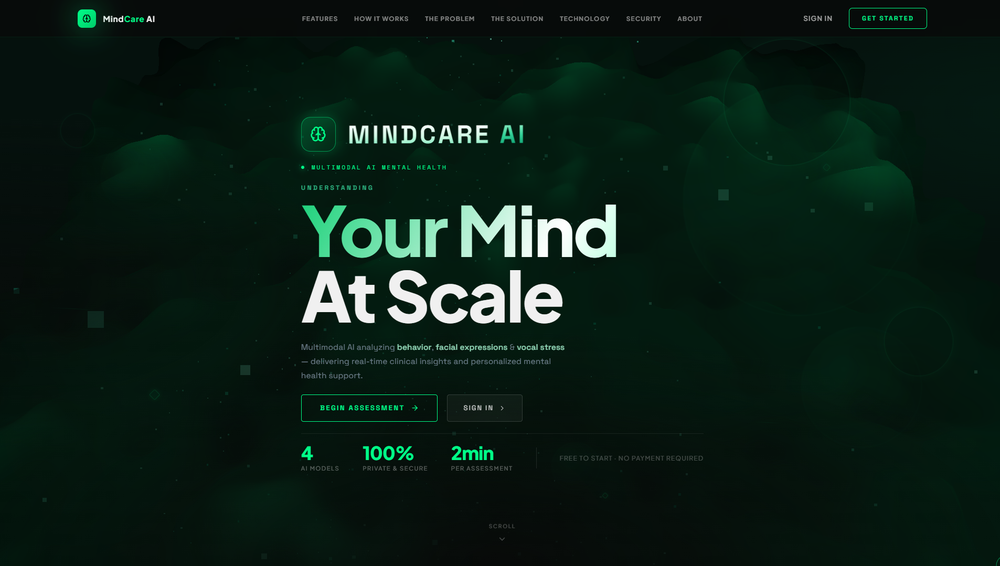 | 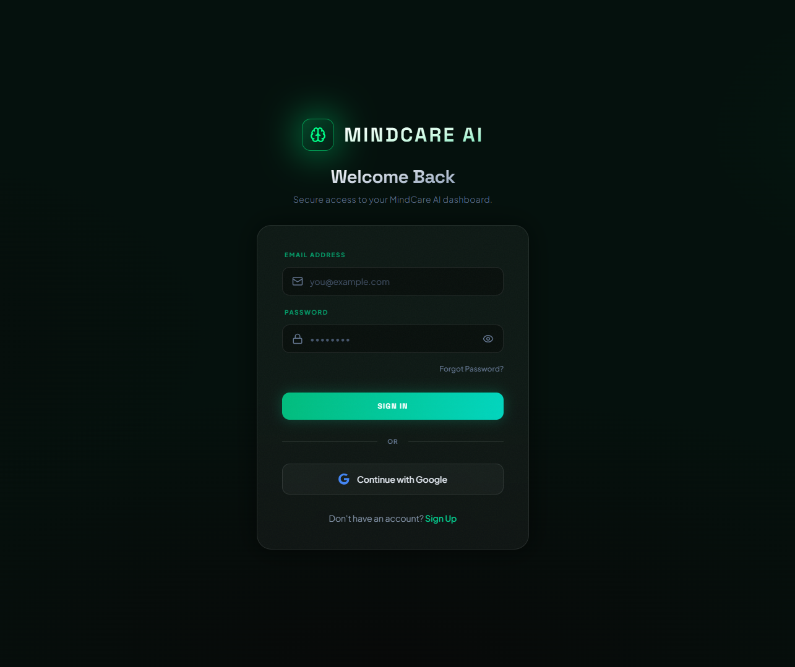 |

| 3. Step 1: Behavioural Biometrics | 4. Behavioural Classification Results |
| :---: | :---: |
| 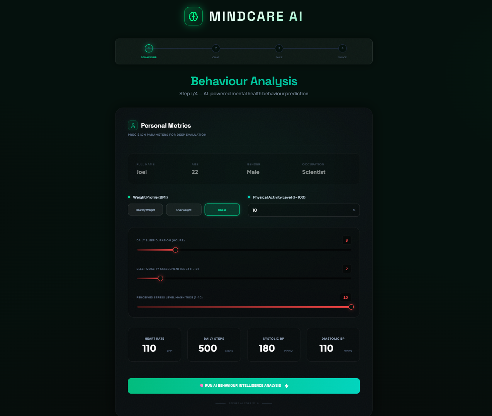 | 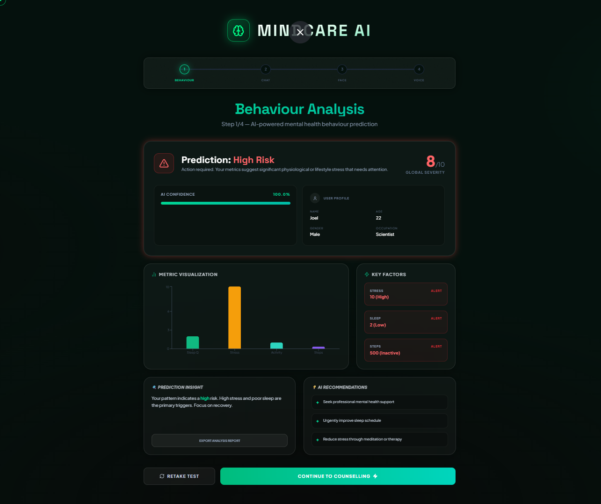 |

| 5. Step 2: AI Clinical Counselling | 6. Step 2: NLP Diagnostic Summary |
| :---: | :---: |
| 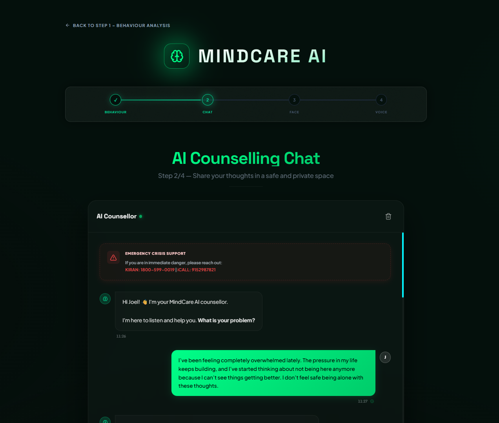 | 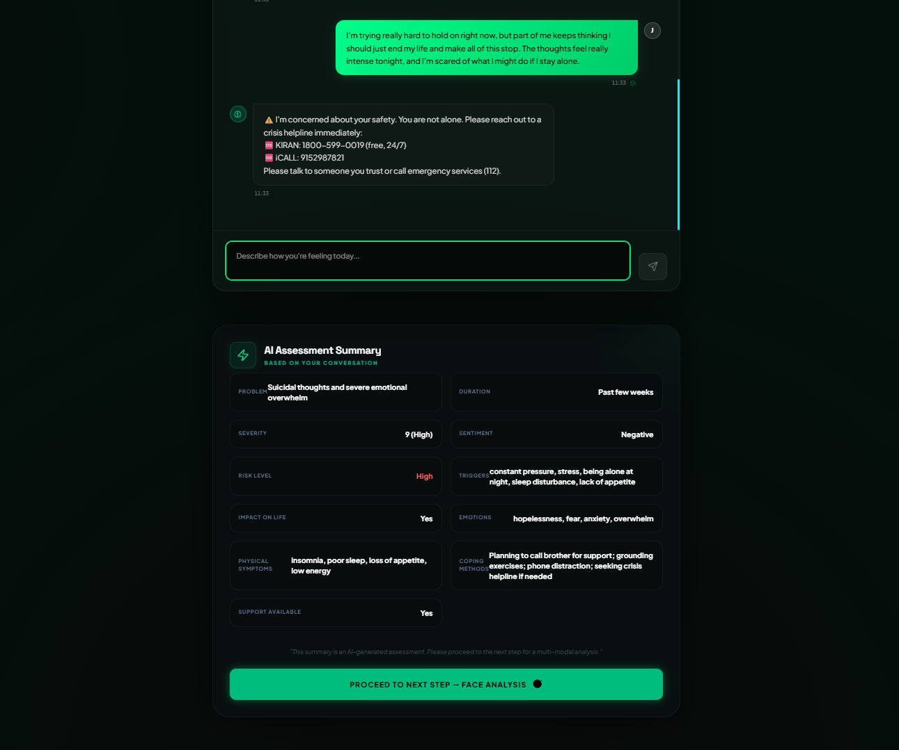 |

| 7. Step 3: Facial Affect Capture | 8. Step 3: Computer Vision Results |
| :---: | :---: |
| 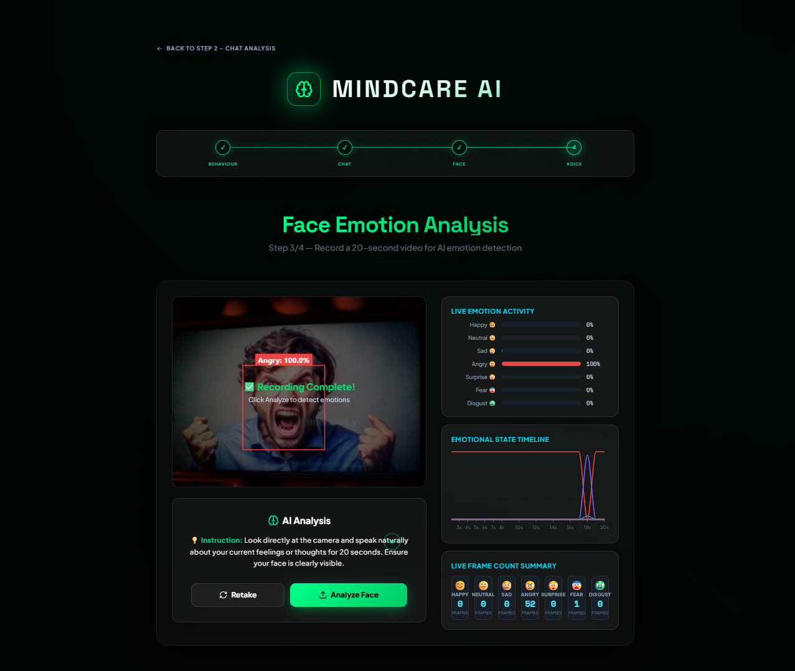 | 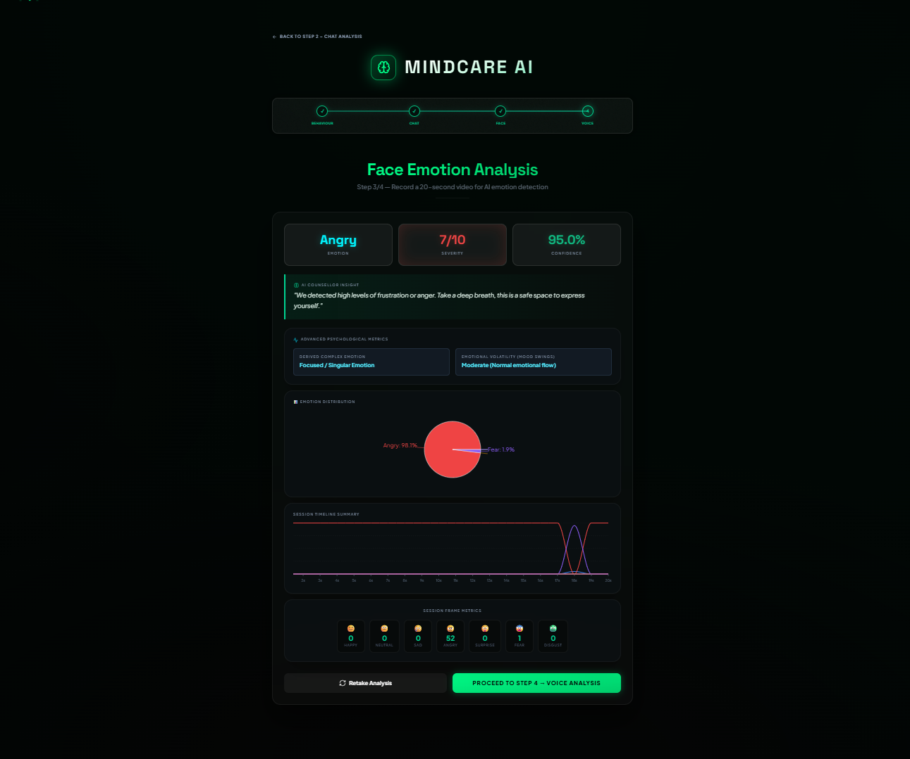 |

| 9. Step 4: Voice Acoustic Analysis | 10. Step 4: Vocal Stress Results |
| :---: | :---: |
| 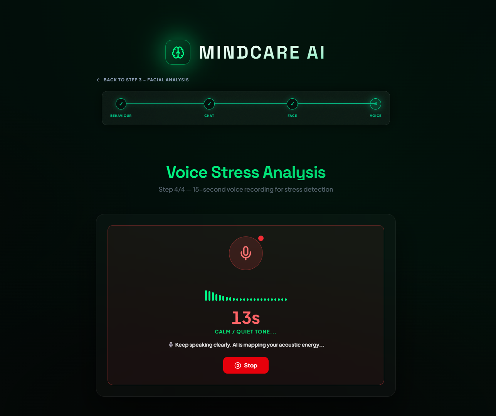 | 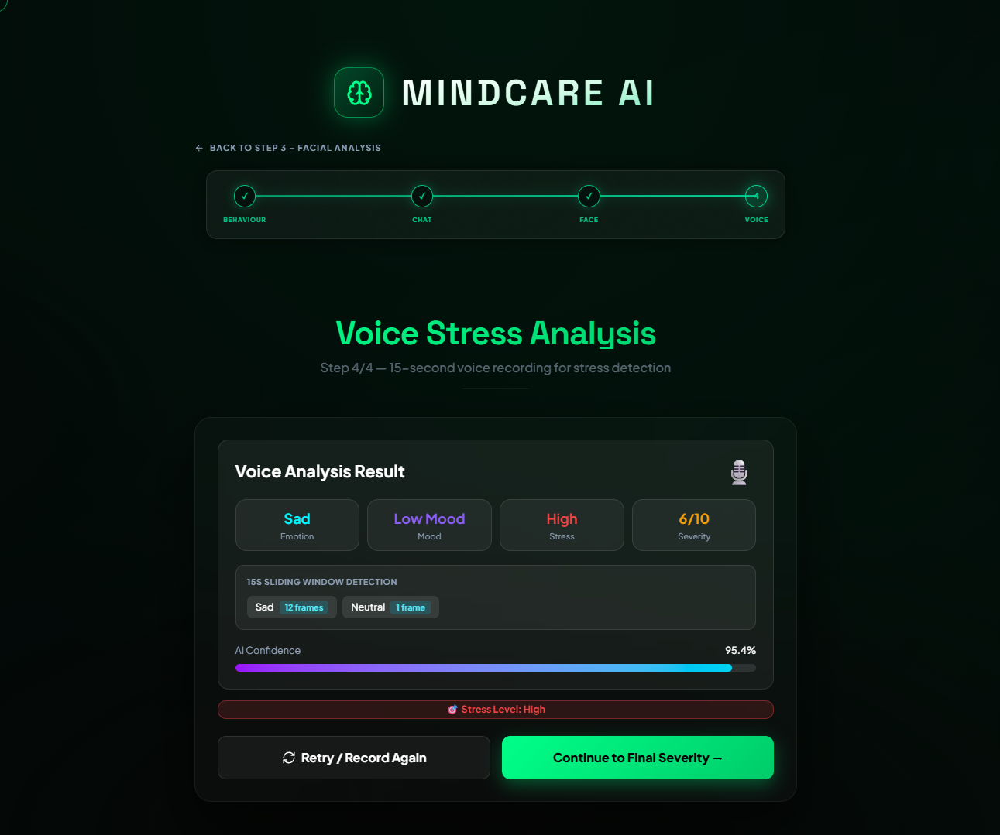 |

| 11. Step 5: Fused Multimodal Report | 12. Personalized Clinical Dashboard |
| :---: | :---: |
| 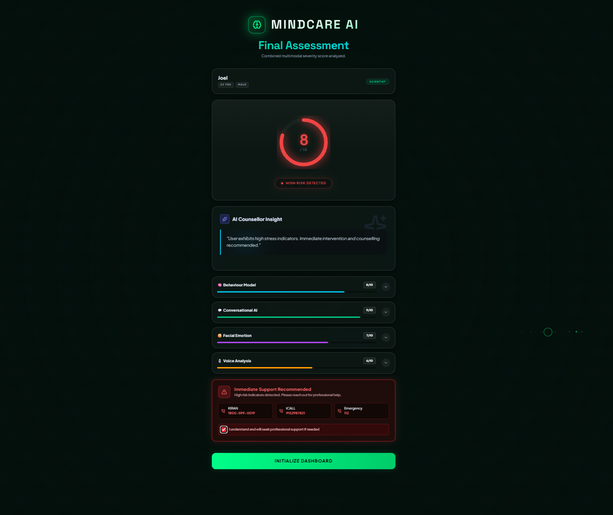 | 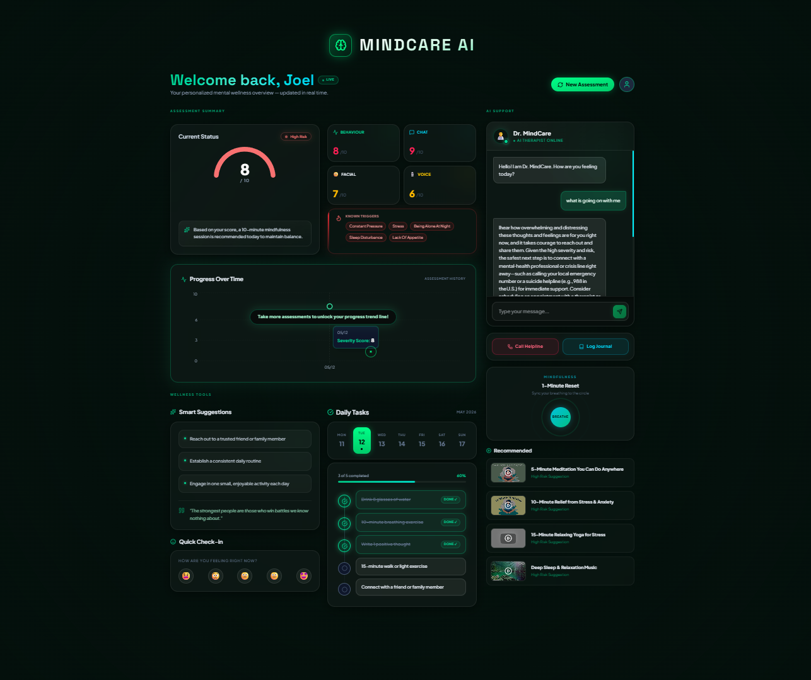 |

---

## 🛡️ Security, Privacy & Crisis Safeguards

MindHealth implements strict clinical data privacy practices:

1. **Ephemeral Sensor Processing**: Video recordings and audio streams collected during assessment steps are processed through memory buffers and can be automatically purged following inference extraction.
2. **Cryptographic Protection**: Passwords are protected using `bcrypt` with automated salting. All authenticated API transactions require signed JWT tokens validated on every request.
3. **Automated Crisis Intervention**: The platform continuously monitors assessment inputs for acute self-harm indicators. If detected, an unclosable emergency banner immediately provides validated crisis intervention hotlines:
   - **Tele-MANAS** (National Tele Mental Health Programme): `14416`
   - **KIRAN Mental Health Helpline**: `1800-599-0019`
   - **Vandrevala Foundation**: `+91 9999 666 555`
4. **Clinical Disclaimer**: MindHealth is an assistive screening and wellness platform. It does not issue official psychiatric diagnoses or prescribe pharmaceutical treatment. Users exhibiting severe distress are directed toward licensed medical practitioners.

---

## 🎯 Practical Use Cases

- **University & Campus Wellness Centers**: High-volume, non-stigmatized preliminary triage allowing students to self-screen before booking psychiatric counseling appointments.
- **Enterprise Workplace Wellness**: Continuous, voluntary employee stress monitoring to identify systemic burnout before it causes severe clinical exhaustion.
- **Clinical Intake Pre-Screening**: Provides therapists with a pre-compiled, multimodal intake dossier before a patient's first clinical consultation, saving valuable consultation time.
- **Remote Tele-Health Screening**: Expands access to structured psychiatric screening in rural or underserved regions lacking dedicated clinical specialists.

---

## ⚖️ Advantages & Technical Limitations

### Advantages
- **Cross-Modality Validation**: Significantly reduces false positives by verifying whether verbal complaints align with acoustic stress and facial affect.
- **Continuous Tracking**: The longitudinal dashboard tracks severity score trends over time, measuring the effectiveness of lifestyle interventions.
- **Accessible Client Interface**: Built entirely with browser-native WebRTC and Web Audio APIs—no specialized external hardware or mobile installations required.

### Current Limitations
- **Hardware Variation Sensitivity**: Low-resolution webcams under poor lighting conditions or noisy microphones can degrade facial recognition confidence and audio feature extraction.
- **Language Scope**: Conversational NLP and acoustic feature models are currently optimized primarily for English-language speech patterns.
- **Client Processing Constraints**: Older client devices may experience slight frame drops during real-time client-side face detection rendering.

---

## 🔮 Future Scope & Engineering Roadmap

- [ ] **Wearable IoT Biosensor Synchronization**: Direct API ingestion from Apple HealthKit and Google Health Connect to continuously pull real-time Heart Rate Variability (HRV) and electrodermal activity.
- [ ] **Multilingual Acoustic Models**: Expansion of vocal stress detection pipelines to cover Spanish, Hindi, Mandarin, and regional dialects.
- [ ] **Edge Inference via ONNX / WebGL**: Compiling ResNet-50 and 1D CNN models to ONNX runtime for full zero-latency edge inference directly inside the browser.
- [ ] **Clinician Tele-Consultation Portal**: Role-based access control for licensed mental health professionals to review anonymized patient dossiers and conduct secure telehealth video sessions.

---

<div align="center">

**MindHealth — Engineered for Objective, Compassionate Mental Health Screening.**

*Distributed under the MIT License.*

</div>
